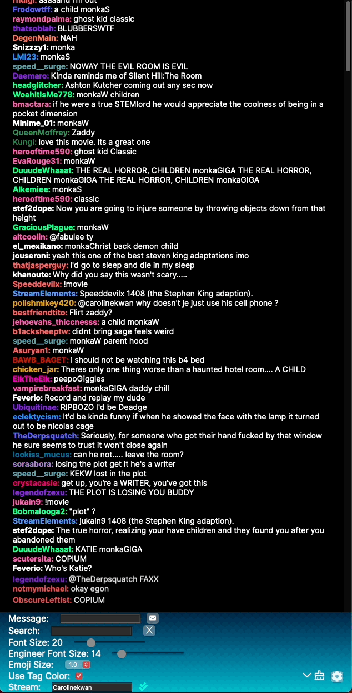

# ProChat

ProChat is a tool for streamers and teams of streamers to manage and monitor their chat.
It is mainly meant for a team consisting of an engineer and a performer. ProChat displays the Twitch chat in 2 windows. 

- Engineer - Controls the style, filters, custom messages, etc

- Performer - Views the chat, highlights, and custom messages from the engineer

## Features:

1. Chat Monitoring: Easily keep an eye on your chat to engage with your audience without any distractions.
2. Newcomer Alerts: Any chatter new to the stream will be highlighted for the duration of the stream.
3. Custom messages from the engineer: for seamless performances.
4. Message Search: Quickly search messages by keyword or username.
5. Highlights: Highlight a specific message for your performer by clicking a message (single message highlight)
6. Custom Emote Support: Recognize and display custom emotes with the help of 'simple-tmi-emotes'.
7. Powered by Tauri: Lightweight and efficient, enjoy native performance on all platforms.

## Getting Started:

To set up a development environment or build the application for production, use the following scripts:

- `yarn tauri dev`: Start the development server
- `yarn tauri build`: Build the application for production

The application uses Tauri for a lightweight and efficient cross-platform experience, you'll need:

- `@tauri-apps/api`
- `@tauri-apps/cli`
